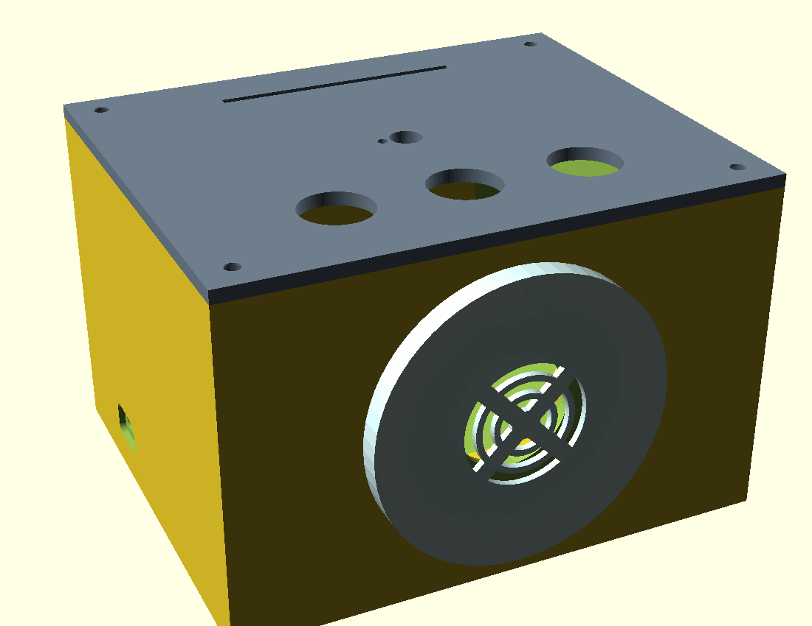

# ESPuino boxes

Build profiles, wiring notes and printable enclosures for two DIY RFID audio
players built with [ESPuino](https://github.com/biologist79/ESPuino).
Insert a card, play an audiobook, and use the buttons and encoder for playback.

These are community reference builds based on physical boxes. Each profile pins
a firmware revision; compatibility with current upstream branches or other board
variants is not implied. Firmware changes live in the
[ESPuino fork’s `s3-test-all` integration branch](https://github.com/mgoodfellow/ESPuino/tree/s3-test-all),
not in this repository. The build guide starts from that fork/branch, then checks
out the exact recorded revision from the selected profile’s `upstream.lock`.
These older snapshots are retained for reproducibility; they do not follow the
current branch head automatically.

| Profile | Hardware | Storage | LEDs | Bluetooth |
|---|---|---|---|---|
| [s3-proto](boxes/s3-proto/README.md) | ESP32-S3 DevKitC-1 clone **N16R8**, 16MB flash / 8MB octal PSRAM | External SPI microSD | 12 WS2812B, NeoPixelBus LCD/GDMA | Disabled; no Classic Bluetooth |
| [kidbox-lolin-1](boxes/kidbox-lolin-1/README.md) | WeMos LOLIN D32 Pro V2.0.0, **16MB flash**, WROVER PSRAM | Onboard SPI microSD | 12 WS2812B, NeoPixelBus I2S1 | Enabled in the profile |

Both use a MAX98357A mono amplifier, RC522 reader, EC11 encoder and three
buttons. Both documented builds use a **5V USB supply**, without batteries.
The S3 also has notes for an experimental PN5180 reader swap.

## Start here

1. Choose a profile above and check its wiring against your actual board.
2. Follow the [build and first-boot guide](docs/espuino-build-guide.md).
3. Build the pinned firmware before adapting settings to another revision.
4. Try the [enclosure](case/README.md) after the electronics work on the bench.

### ESP32-S3 compilation fails on ESP32-A2DP?

The [S3 PlatformIO override](boxes/s3-proto/platformio-override.ini) sets
`lib_ignore = ESP32-A2DP`, and its settings leave `BLUETOOTH_ENABLE` disabled.
The library exclusion matters: the dependency finder can otherwise build A2DP
although the feature is disabled. The profile also supplies the N16R8 memory
configuration and a fixed toolchain URL. See the
[S3 setup and troubleshooting notes](boxes/s3-proto/README.md).

## Printable case

The image is a CAD preview. Editable OpenSCAD and STL exports include a card
slot, speaker/ring cover, two carrier layouts and an optional RC522 offset shim.
Carrier mounts fit the measured perfboard assemblies, not bare development-board
mounting holes. Start with the fit coupon and measure your parts.

## What is included

- `boxes/`: build settings, pin maps, firmware revision locks and wiring.
- `deploy.sh`: copies one profile into a separate ESPuino checkout and builds it.
- `docs/`: build instructions and the release verification record.
- `case/`: enclosure source, exports, dimensions and fixings.

Saved Wi-Fi networks, RFID-to-audio mappings and other runtime settings live on
the device. They are not supplied here. Existing runtime settings can override
compiled defaults. Audio files are not included.

## Contributions and scope

Corrections and reports from other builds are welcome. Include the exact board,
profile, firmware commit and a redacted build/boot log. Explain what you tested
on hardware. Please keep wiring specific to a profile and avoid committing
credentials, NVS dumps or personal card mappings.

This is a hobby project, with no promised support schedule. Firmware bugs belong
upstream when reproduced there; profile and enclosure problems belong here.
See [verification and limitations](docs/VALIDATION.md) for the release evidence.

## License and credits

Released under [GNU GPL version 3](LICENSE). Configuration headers are modified
from ESPuino; see [NOTICE.md](NOTICE.md) for attribution and CAD provenance.
